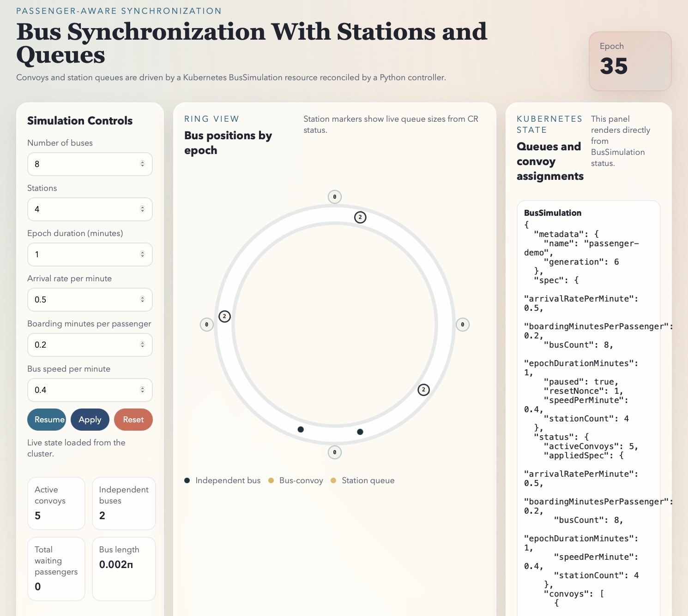

# 📦 Bus Simulation Using CRDs

This repo contains a Kubernetes-native implementation of the passenger-aware
bus synchronization demo. Details are described in [Time Again].

## 🌟 Highlights
Kubernetes implementation includes:
- `BusSimulation` custom resource stores desired simulation inputs in `spec`
- A Python controller reconciles the resource and writes live simulation state into `status`
- A FastAPI service serves the UI and exposes a small API for reading and patching the `BusSimulation`
- The browser renders only data returned by the API; the controller is the only component that advances simulation time

## ℹ️ Overview

Please refer to [Time Again] for the specific blog and the relevant repo(s). If you don't have time TL;DR:

This demo provides a simulation of a number of buses moving across a circular track with uniformly distributed stations. The velocity of buses, number of passengers arriving at stations, the duration for each passenger to load a bus as well as the number of buses and stations are parameters of the simulation. How long it takes for buses to for a single convoy from their initial state when they are uniformly distributed across the track is the interesting outcome to be observed.  

### ✍️ Authors

All repos shared in [CurioCopia] are shared under Creative Commons license for others to adopt and use it as they wish.

## 🚀 Usage

1. Generate your own Docker image for [bus-passenger-controller], place it in your favorite registry.
2. Generate your own Docker image for [bus-passenger-ui], place it in your favorite registry.
3. Clone this repo, adjust the essential parameters in [demo], run kustomize to generate the resources.
4. Access the UI via browser and enjoy.



## ⬇️ Installation

Let's follow the typical Kustomize installation process.

Define a place to work:
```bash
TEST_HOME=$(mktemp -d)
```

### Set Up the Custom Resource Definition
```bash
CRDS=$TEST_HOME/crds
mkdir -p $CRDS

CONTENT="https://raw.githubusercontent.com/Curiocopia/blog-time-again/refs/heads/main"

curl -s -o "$CRD/#1" "$CONTENT/crds\
/{crd.yaml}"
```

Look at the directory:
```bash
tree $TEST_HOME
```
Expect something like:
```bash
/tmp/tmp.00sZsfiC3c
└── crds
    └── crd.yaml
```

Install the `bussimulations.demo.sync` CRD:
```bash
kubectl apply -f $CRDS/crd.yaml
```

### Establish the Base

```bash
BASE=$TEST_HOME/base
mkdir -p $BASE

curl -s -o "$BASE/#1" "$CONTENT/base\
/{controller-deployment.yaml,kustomization.yaml,rbac.yaml,sample-bussimulation.yaml,serviceaccount.yaml,ui-deployment.yaml,ui-service.yaml}"
```
Look at the directory:
```bash
tree $TEST_HOME
```
Expect something like:
```bash
/tmp/tmp.00sZsfiC3c
└── crds
    └── crd.yaml
└── base
    ├── controller-deployment.yaml
    ├── kustomization.yaml
    ├── rbac.yaml
    ├── sample-bussimulation.yaml
    ├── serviceaccount.yaml
    ├── ui-deployment.yaml
    └── ui-service.yaml
```
### The Base Customization

The base directory has a kustomization file:
```bash
more $BASE/kustomization.yaml
```
You can run kustomize on the base to emit customized resources to stdout and inspect:
```bash
kustomize build $BASE
```
Adjust the values of the kustomize output as you see fit.

Once you are satisfied, apply all the kustomized resources:
```bash
kustomize build $BASE | kubectl apply -f -
```

Once the resources are running, access the UI: http://$NODE_IP:30080

## Create Overlay

Create a `demo` overlay.
```bash
OVERLAYS=$TEST_HOME/overlays
mkdir -p $OVERLAYS/demo
```
## Demo Customization

```bash
curl -s -o "$OVERLAYS/demo/#1" "$CONTENT/overlays/demo\
/{kustomization.yaml,sample-bussimulation-patch.yaml}"
```
Adjust the parameters as you need. Set `namespace` for all resources, `bus-passenger-controller` and `bus-passenger-ui` in `kustomization.yaml`:
```yaml
namespace: demo

images:
- name: YOUR_REGISTRY/bus-passenger-controller
  newName: my-registry/bus-passenger-controller
  newTag: latest
- name: YOUR_REGISTRY/bus-passenger-ui
  newName: my-registry/bus-passenger-ui
  newTag: latest
```
Adjust `sample-bussimulation-patch.yaml` values to adjust the initial state of the `passenger-demo`.

You can run kustomize on the demo to emit customized resources to stdout and inspect:
```bash
kustomize build $DEMO
```
Adjust the values of the kustomize output as you see fit.

Once you are satisfied, apply all the kustomized resources after you create the namespace `demo`:
```bash
kustomize build $DEMO | kubectl apply -f -
```

Once the resources are running, access the UI: http://$NODE_IP:30080

## 💭 Feedback and Contributing

If you have any other suggestions for improvements or corrections, please drop a note in Discussions.

[Time Again]: https://curiocopia.com/blog/time-again
[Curiocopia]: https://curiocopia.com
[bus-passenger-controller]: https://github.com/Curiocopia/bus-passenger-controller
[bus-passenger-ui]: https://github.com/Curiocopia/bus-passenger-ui
[demo]: overlays/demo/